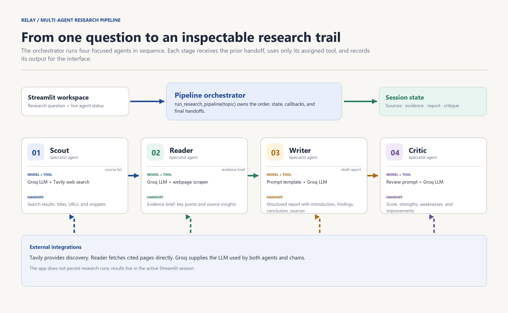
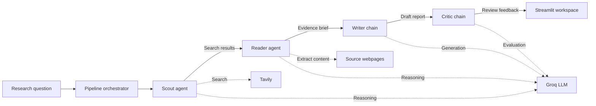

# Relay — multi-agent research studio

Relay is a small, inspectable research workflow built with LangChain, Groq, Tavily, and Streamlit. Instead of asking one model to do everything, it moves a research question through four focused agents: source discovery, evidence extraction, report writing, and critical review.

The goal is simple: make the work of a multi-agent system visible. Every stage has one responsibility, a defined tool set, an explicit handoff, and an output that can be inspected in the Streamlit workspace.



## What it does

- Accepts one research question in a Streamlit workspace.
- Uses a Scout agent to find up-to-date, relevant web sources with Tavily.
- Uses a Reader agent to extract useful content from cited web pages.
- Uses a Writer chain to create a structured report from the evidence brief.
- Uses a Critic chain to score the draft and suggest concrete improvements.
- Shows source cards, research notes, the report, and critique separately so the intermediate work is not hidden.

## Architecture



### Agent responsibilities

| Stage | Component | Tool access | Output handed to the next stage |
| --- | --- | --- | --- |
| 1. Discover | **Scout agent** | Tavily search | Source titles, URLs, and snippets |
| 2. Read | **Reader agent** | Webpage scraper | Key points and evidence brief |
| 3. Write | **Writer chain** | None | Structured research report |
| 4. Review | **Critic chain** | None | Score, strengths, weaknesses, and recommendations |

The orchestrator in `pipelines/pipeline.py` owns the stage order and keeps the outputs in a single state dictionary:

```python
{
    "search_results": "...",
    "reader_results": "...",
    "report": "...",
    "critic_feedback": "...",
}
```

## Project structure

```text
.
├── agent/
│   └── agent.py                    # LLM, LangChain agents, writer and critic chains
├── tools/
│   └── tool.py                     # Tavily search and webpage scraping tools
├── pipelines/
│   └── pipeline.py                 # Search → read → write → review orchestration
├── docs/
│   └── architecture.png            # Architecture diagram used in this README
├── scripts/
│   └── render_architecture_diagram.py
├── app.py                           # Streamlit multi-agent research workspace
├── main.py                          # Minimal command-line runner
├── requirements.txt
└── README.md
```

## Requirements

- Python 3.10 or newer
- A Groq API key
- A Tavily API key

## Quick start

Clone the project and create a virtual environment:

```bash
git clone https://github.com/Blaze1133/Langchain-Multi-Agent.git
cd Langchain-Multi-Agent
python -m venv venv
```

Activate it:

```bash
# Windows PowerShell
.\venv\Scripts\Activate.ps1

# macOS / Linux
source venv/bin/activate
```

Install dependencies:

```bash
pip install -r requirements.txt
```

Create a `.env` file in the repository root:

```env
GROQ_API_KEY=your_groq_api_key
TAVILY_API_KEY=your_tavily_api_key
```

Run the visual workspace:

```bash
streamlit run app.py
```

Then open the local URL Streamlit prints, normally `http://localhost:8501`.

For a terminal-only run, edit the topic in `main.py` and run:

```bash
python main.py
```

## How the pipeline works

1. The user supplies a research question.
2. The pipeline builds the Scout agent with only the `web_search` tool available.
3. The LLM decides when to call that tool; Tavily returns a small list of sources.
4. The Reader agent receives that source list and can use only `scrape_webpage` to read a cited page.
5. The Writer chain receives the original topic plus the Reader’s evidence brief and drafts the report.
6. The Critic chain receives the completed report and returns editorial feedback.
7. The Streamlit interface displays each agent’s distinct output, rather than only the final answer.

This is a sequential multi-agent workflow. The Python pipeline chooses the order; the LLM decides how to use the tool it is given at each agent step.

## Tools

### `web_search(query)`

Wraps `TavilySearch` and returns a consistent plain-text source list containing each result’s title, URL, and snippet. The tool checks the API response shape before formatting it, which avoids UI-breaking result parsing errors.

### `scrape_webpage(url)`

Downloads a webpage, uses Readability to identify the main article content, and turns the result into plain text with BeautifulSoup. A readable error message is returned if the request or extraction fails.

## Streamlit workspace

The frontend is intentionally not a generic chatbot. It provides:

- A visible multi-agent crew with state badges.
- A live status log while the pipeline runs.
- An interactive agent selector for inspecting Scout, Reader, Writer, or Critic work.
- Clickable source cards for Scout’s research.
- Markdown-rendered reports, including headings, lists, links, and tables.
- A final architecture diagram that documents how the pieces fit together.

Research data is stored only in Streamlit session state for the active browser session. It is not persisted to a database.

## Troubleshooting

| Problem | What to check |
| --- | --- |
| `GROQ_API_KEY` error | Add a valid `GROQ_API_KEY` to `.env` and restart the app. |
| Tavily search fails | Confirm `TAVILY_API_KEY` is present and active. |
| A page cannot be read | Some sites block automated requests or do not expose a readable article body. Try another source. |
| `string indices must be integers` from search | Pull the latest version. The search tool now validates Tavily response data before formatting it. |
| Streamlit page does not update | Stop the server and run `streamlit run app.py` again. |

## Development notes

To regenerate the committed architecture image after changing the system:

```bash
python scripts/render_architecture_diagram.py
```

The diagram renderer uses Pillow, which is available in the current development environment. If you create a fresh environment and need to regenerate it, install Pillow first:

```bash
pip install pillow
```

## Roadmap

- [ ] Let the Reader scrape multiple selected sources instead of relying on the agent’s default selection.
- [ ] Add citations to structured report sections.
- [ ] Support export to Markdown or PDF.
- [ ] Save research runs locally or to a database.
- [ ] Add retries and tracing for individual agent/tool failures.

## Contributing

Issues and pull requests are welcome. Keep changes focused, preserve the explicit handoff between agents, and run the Streamlit app before opening a pull request.

## License

No license file has been added yet. Add an explicit license before distributing or reusing the project as an open-source package.
